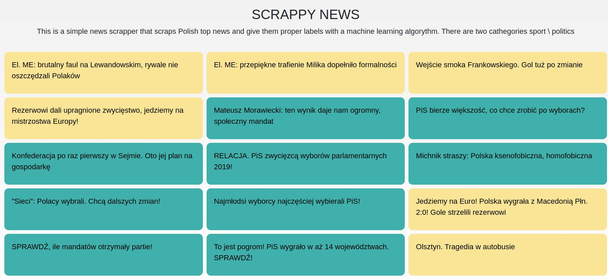

# Scrappy news
This is a simple news scrapper with a machine learning algorythm for news header categorize. It has been uploaded as a beta version. 

You can try it [HERE](https://scrappynews.herokuapp.com/)

### How it works?
* First it looks into Https://newsapi.org API to get some top news from Poland. Method gets header title and url. 
* Then header is converted into vector of counted words and transform it by count vectorizer dictionary which I fitted before. 
* This results obtaining an encoded vectors for each header title. 
* Now encoded vectors can be predicted by model since they are sparse matrices

### The main and the only screen

